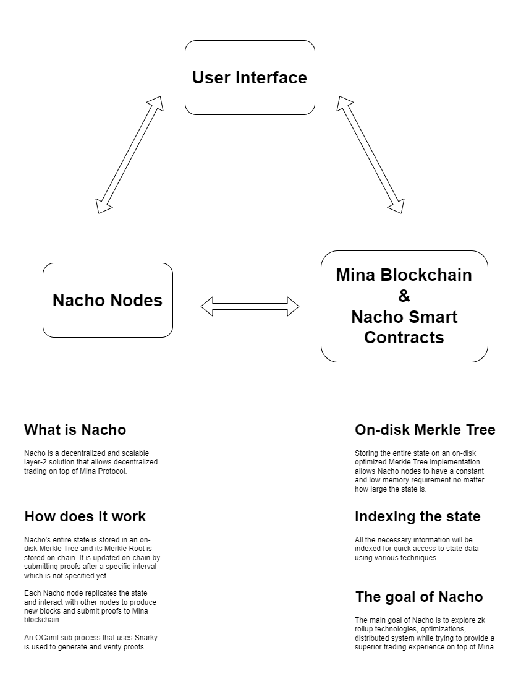

# Nacho

A decentralized and scalable layer-2 solution that allows decentralized trading on top of Mina Protocol.

> Nacho is being built by [**Berzan**](https://berzan.org/) with his love, sweet and tears.